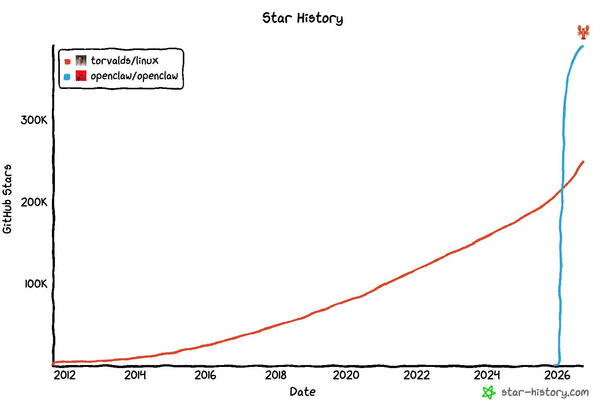
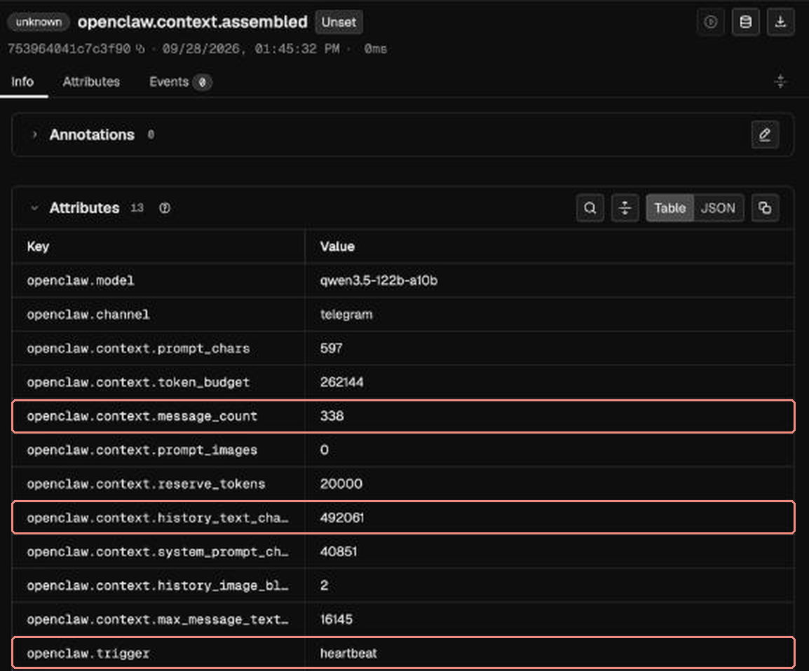
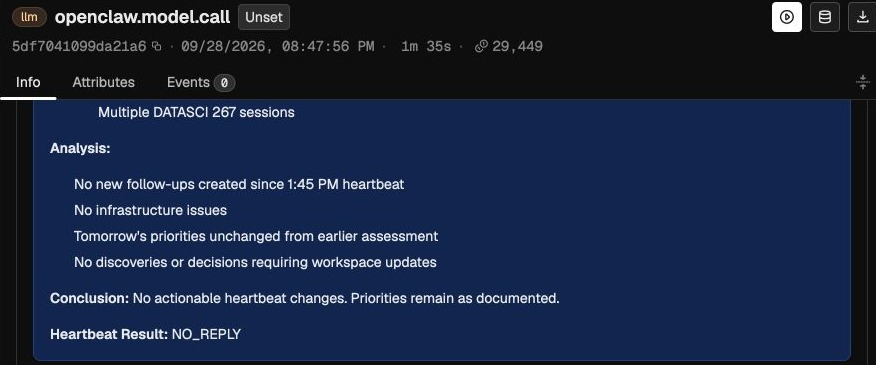
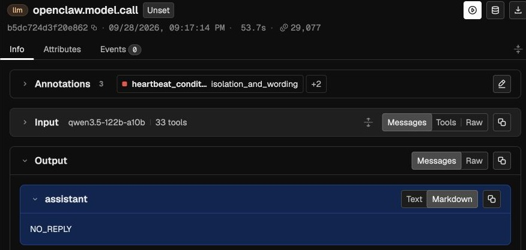

# From traces to a change you can measure: evaluating an always-on OpenClaw assistant with Phoenix

Personal assistants are moving from chat windows to agents that run all day and act on their own schedule. That raises three questions: how do you see what the assistant is doing, how do you know whether it's actually helpful or just staying busy, and how do you improve it without guessing? I used Arize Phoenix to answer these questions.

Mine was busy. I run [OpenClaw](https://github.com/openclaw/openclaw), an open-source assistant, on my own hardware, and every half hour it checks whether anything needs my attention. Too often it decided something did. It sent me internal status reports it was supposed to keep to itself, kept bringing back a deadline I had already corrected, and answered its own timer as if I had just walked in:

> Welcome back, Matilda! I'm continuing from where we left off with the urgent priorities. What would you like to tackle first?

That was its reply to a scheduled check.

Every 30 minutes OpenClaw's heartbeat starts a run on its own. OpenClaw stays silent only if the reply is exactly `NO_REPLY`, and sends anything else to my phone. The results below cover 27 heartbeats on September 28 to 29 by a Qwen3.5 122B assistant, scored with code checks, my own labels and a GPT-6 Sol judge.

----

**What I built:** an observer plugin that makes OpenClaw's traces readable in Phoenix; a labeled dataset of one day's heartbeats, with an LLM judge checked against my labels; and nine everyday tasks that I run as Phoenix experiments to test changes to the harness and to the model.

In this guide you'll learn how to:

- Trace an OpenClaw agent in Phoenix
- Turn a day of messages into a labeled dataset
- Change the harness, experiment and observe the results one piece at a time
- Benchmark different models with the same harness

**Links:** [code](https://github.com/tildahh/openclaw-analysis) · [task dataset](https://app.phoenix.arize.com/s/matildaorona/datasets/RGF0YXNldDoz/examples) · [baseline vs. answer check](https://app.phoenix.arize.com/s/matildaorona/datasets/RGF0YXNldDoz/compare?experimentId=RXhwZXJpbWVudDoxOA%3D%3D&experimentId=RXhwZXJpbWVudDoxOQ%3D%3D&view=grid) · [all four models side by side](https://app.phoenix.arize.com/s/matildaorona/datasets/RGF0YXNldDoz/compare?experimentId=RXhwZXJpbWVudDoyMA%3D%3D&experimentId=RXhwZXJpbWVudDoyMQ%3D%3D&experimentId=RXhwZXJpbWVudDoyMg%3D%3D&experimentId=RXhwZXJpbWVudDoyMw%3D%3D&experimentId=RXhwZXJpbWVudDoyNA%3D%3D&experimentId=RXhwZXJpbWVudDoyNQ%3D%3D&experimentId=RXhwZXJpbWVudDoyNg%3D%3D&experimentId=RXhwZXJpbWVudDoyNw%3D%3D&view=grid)

## Why OpenClaw?

OpenClaw lives in the chat apps people already use, keeps memory, runs tools and wakes itself up on a schedule. So it faces the question every proactive agent will face: should it speak when nobody asked? Others are hitting the same problem. An open OpenClaw [issue](https://github.com/openclaw/openclaw/issues/142588) reports 26 of 27 scheduled heartbeat runs posting narration instead of staying quiet. In the [Proactive Agent](https://arxiv.org/abs/2410.12361) benchmark, models "fail to stay silent when the user does not require any assistance". And OpenClaw is open source, so every part of the harness is yours to change.



*GitHub stars over time, from [star-history.com](https://star-history.com/#openclaw/openclaw&torvalds/linux&Date).*

## OpenClaw architecture

```python
def run(trigger):                        # a chat message, or the 30-minute heartbeat
    context = build_prompt(trigger)      # instructions, workspace files, history
    while True:
        reply = model(context, tools)
        if reply.wants_tool:
            context += [reply, run_tool(reply)]
        else:
            break
    if reply.strip() == "NO_REPLY":
        return                           # stay silent
    send_to_chat(reply)                 
```


The harness runs on local hardware and its LLM endpoint is served on a DGX Spark cluster, from there the traces are being sent to Phoenix Cloud for analysis.

```mermaid
%%{init: {"theme":"base","sequence":{"mirrorActors":false},"themeVariables":{"darkMode":true,"fontSize":"16px","background":"#202226","mainBkg":"#2d3139","primaryColor":"#2d3139","primaryTextColor":"#e6e6e6","primaryBorderColor":"#6b7280","textColor":"#e6e6e6","lineColor":"#a0a7b4","actorBkg":"#2d3139","actorBorder":"#6b7280","actorTextColor":"#e6e6e6","actorLineColor":"#6b7280","signalColor":"#c9ced6","signalTextColor":"#e6e6e6","labelBoxBkgColor":"#2d3139","labelBoxBorderColor":"#6b7280","labelTextColor":"#e6e6e6","loopTextColor":"#e6e6e6","noteBkgColor":"#3a3f4a","noteBorderColor":"#6b7280","noteTextColor":"#e6e6e6"}}}%%
sequenceDiagram
  participant Me as User
  participant OC as OpenClaw
  participant LM as Language model
  participant EV as Eval scripts<br/>(this repo)
  participant PX as Phoenix Cloud

  rect rgb(32, 34, 38)
    Me->>OC: message
    loop until the answer is ready
      OC->>LM: prompt + chat history
      LM-->>OC: answer, or a tool to run
      OC->>OC: run the tool
    end
    OC->>Me: reply
    OC->>PX: traces of every run<br/>(built-in tracing)

    loop every 30 minutes
      OC->>LM: heartbeat: anything new?
      LM-->>OC: reply
      alt nothing new
        OC->>OC: stay silent
      else something new
        OC->>Me: message
      end
    end

    rect rgba(255, 255, 255, 0.07)
      Note over OC,EV: Evaluation (this repo)
      EV->>OC: run a test case<br/>(reply not sent to Telegram)
      OC-->>EV: observer plugin's log
      EV->>OC: read past heartbeats
      OC-->>EV: heartbeat transcripts
      Me->>EV: label each heartbeat
      EV->>EV: judge each heartbeat
      EV->>PX: upload traces, dataset<br/>and judge results
    end
  end
```



## Getting Started

Add your Phoenix API key to `~/.openclaw/.env`

```bash
PHOENIX_API_KEY=your-phoenix-api-key
```

Then add this at the top level of the config file `~/.openclaw/openclaw.json` to turn on OpenClaw's trace export:

```json
{
  "diagnostics": {
    "otel": {
      "enabled": true,
      "protocol": "http/protobuf",
      "tracesEndpoint": "https://app.phoenix.arize.com/s/<space>/v1/traces",
      "headers": { "Authorization": "Bearer ${PHOENIX_API_KEY}" },
      "traces": true,
      "sampleRate": 1,
      "captureContent": true
    }
  }
}
```

Restart the gateway with `openclaw gateway restart`

On its own, the trace export only shows unlabeled and disorganized events in the Phoenix UI.

To make the traces intuative and sessions organized, we had to modify and make a custom plugin you can see here [`observer/`](observer/) and follow the [setup guide](docs/live-conversation-exporter.md). The patch adds the following missing pieces to the traces:

- a `session.id`, so Phoenix groups the turns of one conversation
- A session starts with the first input and the final answer as its output
- a legible process name such as **Conversation**, **Heartbeat**, **Scheduled task** or **Evaluation** so it's easier to find what you are looking for
- legible tool names
- the model's reasoning (this is optional)

To classify whether our heartbeats are providing any useful information, we need to turn them into a dataset for labeling. You can retrieve the stored events for a specific date range, using this script:

```bash
python3 -m scripts.extract_heartbeats --inspect 5
python3 -m scripts.extract_heartbeats --since 2026-09-21
```

Each heartbeat becomes one case: what the assistant wrote, what it wrote at the previous heartbeat, a repeat score between the two, if there was any messages inbetween, token count and duration. The extractor removes contacts and credentials.

For me the results were:
* 11 contained a `NO_REPLY` token
* 9 repeated the previous message almost word for word (similarity 0.8 or higher)
* 13 had no activity

I labeled 27 heartbeats to compare my marks to those of an LLM judge. Most errors were messages that shouldn't have been sent. The hardest cases weren't silent versus missed; it was somewhat useful versus redundant.

I used the following labels: 

| `label` | Message |
|---|---|
| `useful` | Something new I wanted now |
| `somewhat_useful` | Something new, but buried in a recap |
| `redundant` | Nothing new |
| `correct_silence` | It stayed quiet, and that was right |
| `missed` | It stayed quiet, but something needed my attention |
| `unsure` | Not enough evidence to call it |


I then ran an LLM-judge using this [prompt](prompts/heartbeat-judge.md) which sees what the assistant wrote, it's reasoning, and any messages in between this and the last heartbeat. The judge returned the same labels and a short explanation for each heartbeat.

```bash
python3 -m scripts.judge_heartbeats try \
    --cases runs/RUN/cases.jsonl --labels runs/RUN/cases.csv --limit 6
python3 -m scripts.judge_heartbeats build-dataset --name openclaw-heartbeats-v1 \
    --cases runs/RUN/cases.jsonl --labels runs/RUN/cases.csv
python3 -m scripts.judge_heartbeats run --name openclaw-heartbeats-v1 \
    --split tune --experiment judge-v1-tune
```

I used a different judge from my assistant to minimize bias. Before deciding which judge model to use, I tried GPT-6 Sol and GPT-6 Astra. Sol agreed with my labels on 19/22 cases (86%, Cohen's kappa 0.78). Once you've picked what judge you want to use, score every heartbeat and annotate the verdicts onto the traces using the Phoenix API, so you can filter in the UI. You can now use the judge labels to filter for specific types of heartbeats.

```
annotations["heartbeat_usefulness_sol_v1"].label == "redundant"
```

The next step was to find what drives poor performance, change one setting, and compare the same measurements before and after. The first thing I checked washow much history is in the prompt, which showed the first problem:



*The heartbeat's context: a timer trigger carrying 338 messages of history.*

Every heartbeat carried a whole day of the main conversation: 333 to 338 messages, about 188k tokens on the first call. The previous report was in that prompt, and the next report copied 78 to 100% of its lines. And every report ended with `NO_REPLY`, just as the instruction file said:

> For no meaningful change, end with exactly `NO_REPLY`.

OpenClaw stays silent only when the whole reply is the bare token, so a full report with the token at the bottom, which "end with" allows, gets delivered.

I annotated each heartbeat's model calls with a `heartbeat_phase` label, so one filter on the **Spans** tab pulls up before and after:

```
name == "openclaw.model.call" and annotations["heartbeat_phase"].label == "before_change"
name == "openclaw.model.call" and annotations["heartbeat_phase"].label == "after_change"
```

Change to isolated sessions.

```json
"heartbeat": { "isolatedSession": true }
```

Each heartbeat now starts a session of its own. Same model, same tools, same instructions, same schedule.

| | Conversation history loaded | Own session per heartbeat | New instructions |
|---|:---:|:---:|:---:|
| Heartbeats | 5 |11 | 6 |
| Messages in the prompt | ~338 | N/A | N/A |
| Tokens, first model call (median) | **188k** | **21k** | 21k |
| Tokens, whole heartbeat (median) | 373k | 94k | 45k |
| Lines copied from the previous message | **78-100%** | 0-29% | - |
| Reports ending in `NO_REPLY` | **5/5** | 2/10 | 0/1 |
| Stayed silent | 0/5 | 1/11 | 5/6 |
| Sent messages the judge called redundant | 5/5 | 6/8 scored | 0/1 |
| Tool calls per heartbeat | 0-2 | 3-12 | 0-6 |


Some of the heartbeats were still sending messages that ended in `NO_REPLY`, so I rewrote the heartbeat instructions from `end with exactly NO_REPLY` to `reply with exactly NO_REPLY and nothing else`.

Then I measured the heartbeats for usefulness again using the same judge. 

**Before, the last heartbeat under the old instructions:** a report saying nothing actionable changed, ending in `NO_REPLY`. [Open this model call](https://app.phoenix.arize.com/s/matildaorona/projects/UHJvamVjdDoyMw==/traces/b1c56b2ebf8d785ff80e37ec81f7bb8c?timeRangeKey=7d&selectedSpanNodeId=U3BhbjoxNTE2OQ%3D%3D)



**After, the first heartbeat under the new instructions:** the whole reply is `NO_REPLY`. [Open this model call](https://app.phoenix.arize.com/s/matildaorona/projects/UHJvamVjdDoyMw==/traces/046d1e0209511b1d140e263226ba9077?timeRangeKey=7d&selectedSpanNodeId=U3BhbjoxNTY1Mg%3D%3D)




**Results:**

- **Isolation capped the context size, not the behavior.** The reset had already cut the first model call from 188k to 53k and stopped the copying; isolation took it to 21k and kept it there. But the assistant still sent a message on 10 of 11 heartbeats, and 2 of them were reports ending in `NO_REPLY`, one of which reached my phone. The judge found something useful in 2 of 8 scored messages, up from 0-5. And with no history to lean on, each heartbeat re-read its notes: 3-12 tool calls instead of 0-2.
- **Silence is not the same as checking.** Four of the five silent heartbeats never read the calendar or reminders. The first heartbeat with the new tools did read the reminders, and sent the overdue one. Then I added one sentence telling the heartbeat to check live sources first, and removed a stale line from its notes about another scheduled task's hours, which it had confused with its own. The next two heartbeats read the calendar and reminders, then re-sent the reminder that heartbeat had already sent. The judge called both redundant.

## 6. Benchmark everyday tasks to assess and improve performance

I wrote nine test cases based on how I want to be able to use my OpenClaw agent, from flight options to LoRA calculations and turned them into a Phoenix dataset.

It's imporant that each question starts in a fresh workspace and session, seeded without earlier drafts, so the assistant has to do the work again. This is the [script](scripts/run_clean_trial.py) I used to to build the test environment`scripts/prepare_task_workspace.py`.

Analyze the performance in the Phoenix dashboard or by the help of LLM judges.

The common issue in my responses was an answer that wasn't faithful to the context the assistant had already retrieved. So I added the following to the instructions: "verify decision-critical claims against the request and the sources, resolve conflicts, and say what remains unverified". Then I reran the same dataset 3 times and compared the results in Phoenix's [experiment view](https://app.phoenix.arize.com/s/matildaorona/datasets/RGF0YXNldDoz/compare?experimentId=RXhwZXJpbWVudDoxOA%3D%3D&experimentId=RXhwZXJpbWVudDoxOQ%3D%3D&view=list).

**Results:**

- **The prompt didn't fix the underlying issues.** It fixed the event inquiry task and broke on the weekly reading list since it determined the homework material were behind a sign-in it couldn't reach so it listed none. As a solution, I decided to add more tools to the harness, such as a flight search and a course site reader, so the assistant could retrieve the right information.
- **Better tools improved retrieval.** All three flight attempts used the flight search, but two mixed up prices with other itineraries. Overall, 8 of 26 answers met every requirement and 18 failed, plus 1 setup failure before the model saw the question. The grader marked 5 of those 8 UNSURE; I checked each by hand and all 5 were right. Two of the 8 were the LoRA calculation, which needs no tools. Most failures came after retrieval: the evidence was in the trace, and the answer didn't follow it.

## Model abalation

The last experiment aimed to find out how much of the task failures come from the model, by running the same nine tasks with the same harness on other open models.


*Every task, run, and model combination.*

| Model | Runs | PASS | Everything else |
|---|---|---|---|
| Qwen3.5 122B | 3 | 8 of 27| 18 FAIL (1 setup failure) |
| Nemotron 3 Super 120B | 3 | 9 of 27 | 15 FAIL (3 timeouts, 10 min timer) |
| Qwen3.6 35B | 1 | 2 of 9 | 7 FAIL |
| Muse Glimmer 30B | 1 | 1 of 9 | 5 FAIL (3 timeouts) |

Four of the nine tasks never passed on any model in any run: flight options, the study schedule, the event inquiry and hackathon preparation.

## Challenges

- **The traces showed that runs happened, not what they did,** so I wrote the observer plugin and exporter patch in section 1.
- **Live traffic confounds every comparison,** so I noted accidental resets and modifications.
- **Environment failures look like model failures.** A sandbox that failed to start and a bug in my own capture reader both looked like bad answers at first.
- **A shared GPU skews timings,** so I compare workload on matched cases and treat runtime as rough.

**What I'd change**
- **Log a score next to every label.** I logged PASS, FAIL and UNSURE as labels only, so Metrics averaged workload but not quality, and the compare view showed quality only row by row. A score with each verdict (PASS = 1) fixes that.
- **Use an LLM-as-a-judge** to track metrics such as faithfulness, task completion and answer quality. 
- **OpenClaw's own export isn't readable in Phoenix yet.** Arize's [coding-harness-tracing](https://github.com/Arize-ai/coding-harness-tracing) covers Claude Code, Codex, Cursor and others, but not OpenClaw, including it would make it way easier to assess an OpenClaw assistant performance. 


**Lessons learned:**
1. **Start with the harness, not the model.** Every heartbeat failure here pointed at the harness: a day of history in the prompt, instructions that said "end with `NO_REPLY`", and a delivery rule that sends anything but the bare token. The everyday-task failures are different: a broad instruction, 12 tools and three other models each left most of them in place.
2. **Aim for the minimum sufficient context preloaded.** A whole day of history made the heartbeat copy itself; no history made it repeat itself in new words. Neither setting told it what it had already sent.
3. **Check that your metrics still catch failures.** The copy metric caught word-for-word repeats and missed reworded ones; the judge, which sees the earlier messages, caught both. Use code where the answer is crisp, like a bare `NO_REPLY`, and a judge where it isn't.


**Further reading**
- [Improving Deep Agents with harness engineering](https://www.langchain.com/blog/improving-deep-agents-with-harness-engineering) (LangChain, February 2026). The model stayed fixed; prompt, tool and middleware changes took Terminal Bench 2.0 from 52.8 to 66.5.
- [How to build agent evals from traces](https://arize.com/resources/agent-evals-from-traces/) (Arize, August 2026). Error analysis, code checks, LLM judges, judge validation and regression datasets, in that order.
- [Aligning LLM Evals with Human Feedback](https://arize.com/docs/phoenix/cookbook/human-in-the-loop-workflows-annotations/aligning-llm-evals-with-human-annotations-typescript) (Phoenix cookbook). Human labels as the expected output and the judge as the task: the pattern behind section 4.
- [A Field Guide to Rapidly Improving AI Products](https://hamel.dev/blog/posts/field-guide/) (Hamel Husain). Error analysis first, then a judge aligned to one expert's labels.
- [CLAUDE.md best practices, learned with prompt learning](https://arize.com/blog/claude-md-best-practices-learned-from-optimizing-claude-code-with-prompt-learning/) (Arize, November 2025). Only the rules changed, and Claude Code's SWE-bench Lite test accuracy improved by 5.19%.
- [Proactive Agent](https://arxiv.org/abs/2410.12361) (Lu et al., 2024). Scores "should I speak now?" with a false-alarm rate; GPT-4o's was 51.85%.

## Appendix

**Heartbeats**

- [Labels](results/labels.csv) and [judge-versus-me pairs](results/judge_holdout.csv); the extractor's [counts](results/summary.json).
- The judge calibration: [the Sol and Astra experiments in Phoenix](https://app.phoenix.arize.com/s/matildaorona/datasets/RGF0YXNldDoy/compare?experimentId=RXhwZXJpbWVudDoxNA%3D%3D&experimentId=RXhwZXJpbWVudDoxNQ%3D%3D&view=metrics), 24 cases run three times each.

- The three runs with tools, in Phoenix: [side by side](https://app.phoenix.arize.com/s/matildaorona/datasets/RGF0YXNldDoz/compare?experimentId=RXhwZXJpbWVudDoyMA%3D%3D&experimentId=RXhwZXJpbWVudDoyMQ%3D%3D&experimentId=RXhwZXJpbWVudDoyMg%3D%3D&view=grid) and [Metrics](https://app.phoenix.arize.com/s/matildaorona/datasets/RGF0YXNldDoz/compare?experimentId=RXhwZXJpbWVudDoyMA%3D%3D&experimentId=RXhwZXJpbWVudDoyMQ%3D%3D&experimentId=RXhwZXJpbWVudDoyMg%3D%3D&view=metrics).


| Question | What changed | Evidence | Result |
|---|---|---|---|
| 1. Why was every heartbeat a copied report? | A whole day of history → its own session per heartbeat | Live: 5 heartbeats before, 11 after | 188k → 21k tokens; copied lines 78–100% → 0–29%; reports ending in `NO_REPLY` 5 of 5 → 2 of 10 |
| 2. Do the instructions cause the leaked `NO_REPLY`? | Rewritten heartbeat instructions: "reply with exactly `NO_REPLY` and nothing else" | Live: 2 heartbeats with only this change, then 4 with other changes too | Both silent; 5 of 6 silent overall, one of them a missed reminder |
| 3. Does checking live sources first help? | One added sentence, and a stale schedule line removed from its notes | Live: 2 heartbeats | Both read the calendar and reminders, then re-sent a reminder already sent |
| 4. Can a judge stand in for my labels? | Nothing: the judge against me | 22 heartbeats | 86% agreement, kappa 0.78, against 55% |
| 5. Does a "final answer check" reduce unsupported claims? | One added instruction | 9 tasks, one run each | 1 clear fix, 1 regression; tokens +6.4% |
| 6. Do more tools help? | 12 tools added | 9 tasks, three runs | 8 of 26 PASS, 18 FAIL, 1 setup failure |
| 7. Does the model matter? | Three more open models, same harness | 4 models, 72 attempts | Nemotron 9 of 27, Qwen3.5 8 of 27, Qwen3.6 2 of 9, Muse 1 of 9 |
