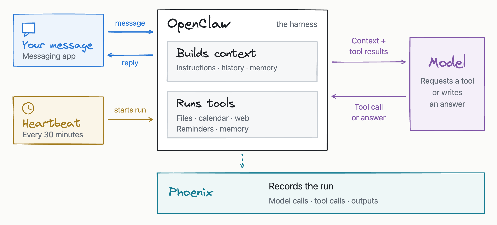
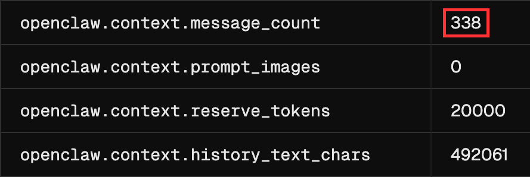
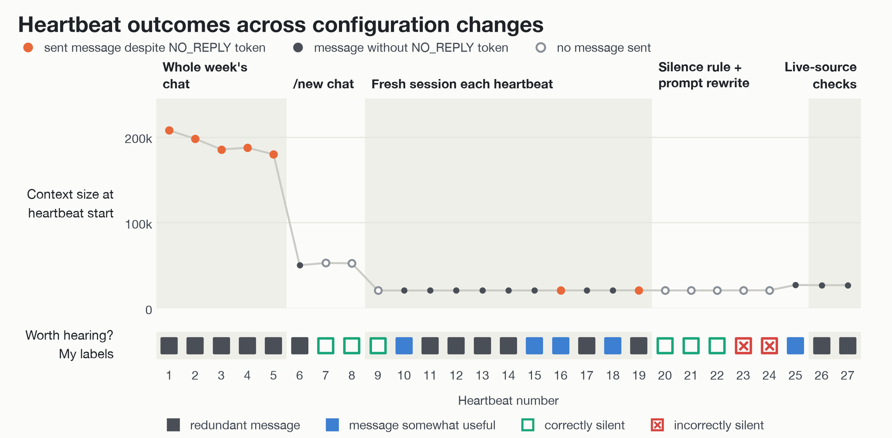
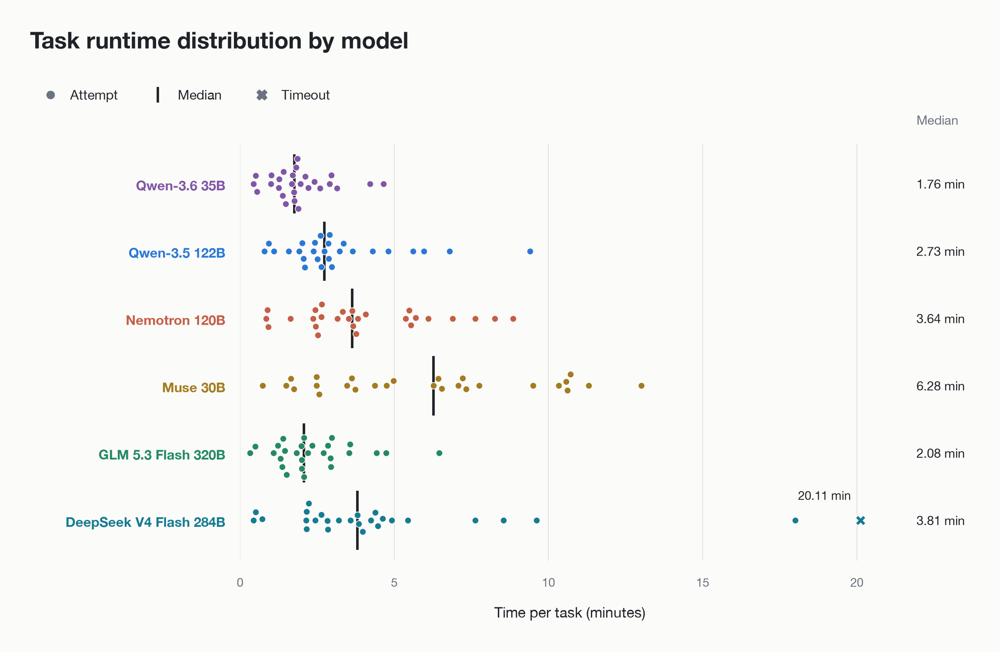
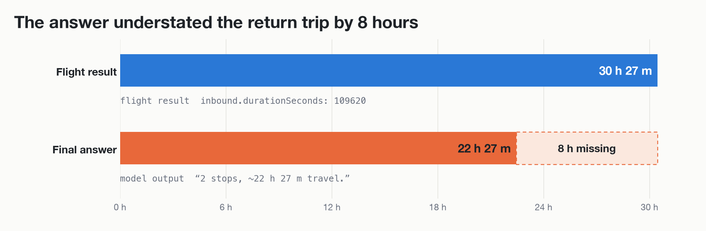

# Improving an OpenClaw assistant with Phoenix

I run [OpenClaw](https://github.com/openclaw/openclaw), an open-source personal assistant, on my own hardware, with Qwen3.5 122B served from a DGX Spark. Every 30 minutes, a scheduled check, called a heartbeat, wakes it to decide whether anything needs my attention.

My assistant kept repeating old information or burying useful updates in long messages. Other users have reported similar problems: in one [GitHub issue](https://github.com/openclaw/openclaw/issues/142588), 26 of 27 scheduled checks sent messages about what the assistant planned to do, without providing a result.

I used [Phoenix](https://github.com/Arize-ai/phoenix) to improve the assistant, by testing changes to its context and instructions, and compare six models on my everyday tasks. In addition I tracked metrics using LLM judges across dimensions such as task completion, tool use, and retrieval relevance to help identify what needed improvement. 

## How the assistant works



OpenClaw (the harness) gives the model its instructions, files, and conversation history. When the model requests a tool, OpenClaw runs it and passes the result back.

A simplified version of the loop:

```python
def run_assistant(trigger):
    """Run the assistant"""
    context = build_prompt(trigger)
    while True:
        reply = model(context, tools)
        if reply.wants_tool:
            context += [reply, run_tool(reply)]
        else:
            break
    if reply.strip() == "NO_REPLY":
        return
    send_to_chat(reply)
```

## See what your assistant is doing

A trace shows the recorded steps in an assistant run, such as model calls and tool calls. Each step is called a span. Phoenix lets you inspect these steps together to find where something went wrong.

To start, add your `PHOENIX_API_KEY` key to `~/.openclaw/.env`.

Then add `diagnostics` to `~/.openclaw/openclaw.json`, replace `<space>` with your Phoenix space, and then restart with `openclaw gateway restart`:

```json
{
  "diagnostics": {
    "otel": {
      "enabled": true,
      "protocol": "http/protobuf",
      "tracesEndpoint": "https://app.phoenix.arize.com/s/<space>/v1/traces",
      "headers": { "Authorization": "Bearer ${PHOENIX_API_KEY}" },
      "traces": true,
      "sampleRate": 1,
      "captureContent": true
    }
  }
}
```

OpenClaw can send traces to Phoenix, but out of the box it wouldn't surface conversations end-to-end. It's based on the [OpenInference](https://github.com/Arize-ai/openinference) framework so I made an [observer plugin](observer/) so conversations and heartbeats would show up as independent sessions. I also made several quality of life improvements, so tools wouldn't show up under the same generic tool name. 

*I made this [setup guide](docs/live-conversation-exporter.md) on how get started with the plugin.*

| Trace detail | Native Phoenix export | My export |
|---|---|---|
| Run type | A generic label | Heartbeat, Conversation, Scheduled task, or Evaluation |
| `input.value` and `output.value` | Missing | The request and final reply |
| `session.id` | Missing | A conversation identifier |
| Tool names | Repeated `openclaw.tool.execution` labels | Names such as `tool: memory_search` |
| Token counts | Aggregate usage only | Recorded without counting the same usage twice |
| Recorded reasoning | Not exported | Optional |


## Start with simple checks

Start with checks you can automate: reply format, repeated text, token counts, and tool calls. This [extraction script](scripts/extract_heartbeats.py) collects heartbeat replies and usage data and removes recognized contact and credential patterns (replace `user@host` with the SSH destination for the machine running OpenClaw.).

```bash
python3 -m scripts.extract_heartbeats --host user@host --since YYYY-MM-DD
```

| Question | What to inspect or measure |
|---|---|
| Did it reply with only `NO_REPLY`? | Check the reply’s text after trimming whitespace. |
| Did it repeat the previous report? | Compare lines in consecutive replies. |
| How much context did it receive? | Read the input-token count for each model call. |
| Did it check the calendar and reminders? | Look for those tool calls in the trace. |

These checks showed that my assistant was copying earlier reports and adding `NO_REPLY` at the end.

## Reduce repeated and unnecessary messages

If your assistant keeps repeating itself, check its conversation history, instructions, and record of previous notifications.

When a scheduled run copies an earlier message, look at whats included in its context. In Phoenix, filter for the `openclaw.context.assembled` span to see how much history was included.

If each run receives the full conversation, try giving it a fresh session. In OpenClaw’s heartbeat configuration, set:

```json
"heartbeat": { "isolatedSession": true }
```

I found out that each heartbeat received 338 earlier messages, nearly half a million characters of conversation history. Fresh sessions reduced the context from 188k to 21k tokens and copied text, but didn’t stop all unnecessary messages.



### Match instructions to the delivery rule

If the assistant says ‘nothing changed’ but still sends a message, check the rule for staying silent. OpenClaw sends nothing only when the entire reply is NO_REPLY. Make that explicit in the instructions:

```diff
- For no meaningful change, end with exactly `NO_REPLY`.
+ For no meaningful change, reply with exactly `NO_REPLY` and nothing else.
+ NO_REPLY means no message reaches the user;  anything else you write is delivered.
```

My old instruction allowed a full report before `NO_REPLY`, which was still delivered. After the instruction changes, the assistant stayed quiet more often, but also missed reminders:

<table>
  <tr>
    <th width="50%">Last heartbeat under the old instructions</th>
    <th width="50%">First heartbeat under the new instructions</th>
  </tr>
  <tr>
    <td></td>
    <td></td>
  </tr>
  <tr>
    <td>Text before <code>NO_REPLY</code> meant the report was delivered.</td>
    <td>The whole reply is <code>NO_REPLY</code>, so nothing is sent.</td>
  </tr>
</table>

### Check current sources and previous notifications

If the assistant misses a reminder, check whether it actually read the calendar and reminders. Require those checks before it decides whether to notify you. Also check what it has already sent so it doesn’t repeat the same reminder.

After I required calendar and reminder checks, both runs repeated a reminder the assistant had already sent. Next, I’d test a log of sent notifications.

### Compare the heartbeat configurations

Review unwanted messages and missed reminders after each change. Track context size and tool use alongside those labels so you can see whether a cheaper run still makes the wrong decision.

To compare phases in Phoenix, label final model-call spans and filter the Spans tab:

```
name == "openclaw.model.call" and annotations["heartbeat_phase"].label == "before_change"
name == "openclaw.model.call" and annotations["heartbeat_phase"].label == "after_change"
```

I added a `heartbeat_condition` annotation to distinguish configurations within the `after_change` group. The table below summarizes the measurements and manually assigned labels for each configuration.

| Measure | Baseline | Chat reset | Fresh sessions | New instructions | Live checks |
|---|---|---|---|---|---|
| Heartbeats | 5 | 3 | 11 | 6 | 2 |
| First prompt median tokens | 188k | 53k | 21k | 21k | 27k |
| Redundant messages | 5 | 1 | 6 | 0 | 2 |
| Missed reminders | 0 | 0 | 0 | 2 | 0 |

The timeline shows how context size and message usefulness varied across those phases:



## Evaluate messages and silences

### Define when a message is warranted

Check both unnecessary messages and missed reminders. If a run crashes or times out, count it separately from a deliberate choice to stay quiet.

Write labels that reflect what the user needs. I labeled a sample of 27 heartbeats with these six categories:

| Label | Meaning |
|---|---|
| `useful` | Something new I wanted now |
| `somewhat_useful` | Something useful, but buried in a long message |
| `redundant` | Nothing I needed from this message |
| `correct_silence` | It correctly stayed quiet |
| `missed` | It stayed quiet, but something needed my attention |
| `unsure` | Not enough evidence to decide |


### Check the judge against your labels

Once you’ve labeled the messages, check whether an LLM judge rates them the same way.

I used GPT-6 Sol to evaluate the Qwen assistant’s messages. It agreed with my labels on 20 of 24 heartbeats.

| Check | Result |
|---|---|
| Agreement | 83% |
| Cohen's κ | 0.73 |
| Agreement from always choosing the most common label `redundant` | 54% |

The four disagreements were:

- Dismissed one message that I thought contained useful new information.
- Unsure about two silences I considered correct. Neither run had checked the calendar or reminders, so the judge lacked the evidence to decide.
- Approved one silence that missed a reminder.

The missed reminder matters most because the judge marked silence as correct when the assistant should have sent a message.

Save the judge’s labels on the traces in Phoenix, where you can filter for a label, such as `redundant`, and inspect the messages behind it. More on this in the Appendix.

### Repeat the checks in everyday use

Check another sample after making changes. Does the assistant still look up current information? Does it send fewer unnecessary messages? Is it missing anything important?

I reviewed another 23 heartbeats the next day. All used tools, and none appended NO_REPLY to a longer message. The judge rated 14 messages somewhat useful, six redundant, and all three silences correct.

| Check | Baseline (5) | After (23) |
|---|---|---|
| Median input tokens on the first call | 187k | 27k (−86%) |
| Messages ending in `NO_REPLY` | 100% | 0% |
| Used tools | Not measured | 100% |
| Stayed silent | 0 | 13% |
| Redundant | 100% | 30% |
| Somewhat useful | 0% | 70% |

## Build a repeatable test set

Test changes on the same set of requests so you can see what improves and what gets worse. Choose tasks that use different tools, and write down what a good answer needs to include before running them.

I used nine everyday tasks covering flights, coursework, event preparation, and model-training calculations, saved as a Phoenix dataset.

For each run:

1. Start a fresh session with the same files. Remove previous answers and drafts so the assistant starts from scratch.
2. Save the request, settings, answer, and tool results. Record any errors or timeouts.
3. Check the answer against your requirements and the sources it used.

Track four things:

- Did it meet every requirement?
- How many requirements did it meet?
- Were its facts and calculations correct?
- Did the run produce an answer, or fail before finishing?

Completeness and correctness are different. A missing booking link makes an answer incomplete. A flight duration that contradicts the search result makes it incorrect.

I used an AI coding assistant to review the answers and cite evidence for each decision.

## Compare prompts, tools, and models

### Test changes to the instructions

Make a change that addresses a problem you found, then rerun the full test set.

My assistant often misread information it had already found. I added this instruction:

> “Before giving a final answer, check that it fulfills the user's request and that its decision-critical claims agree with the evidence you retrieved.”

I tested the original and revised instructions once on each task. With the revised instructions, the assistant corrected an event deadline but stopped returning the weekly reading list. Overall, it met 31 of 52 requirements and used about 6% more tokens.

Check tasks that already worked as well as the problem you wanted to fix. My weekly-reading task asked for the readings, their links, and what was due. The reading-list portion regressed:

| | Original instructions | With the final-answer check |
| --- | --- | --- |
| Reading-list result | Six individual reading links, grouped into two to read and four to skim. | No individual reading links; directed me to sign in to the course website myself. |

The original run opened the course guide and reading list. The revised run only read shortened lists of available documents and never opened the documents themselves. Next, I’d tell it to follow those links and read the full documents, then repeat the tests.

### Test whether new tools improve the assistant

When the assistant lacks information, add a tool that can retrieve it. Then check whether it uses it correctly.

I added 12 tools through MCP, including flight search and a Canvas integration. Using the original prompt, I ran each task three times.

All three flight attempts now found specific itineraries for the requested dates, rather than general fares for other months. But the answers still mixed up details from different offers, including layover cities. Across the tasks, 57% of requirements were met.

Use Phoenix’s comparison view to inspect answers to the same request alongside their runtime and tool use.

### Compare models on the same tasks

To compare models, run each on the same tasks more than once. I tested six models on nine tasks, with three attempts per task. The plot compares median response time with Phoenix’s task-completion score.


*Hardware and [serving settings](#model-observations-and-serving-conditions) differed, so these are results for the tested setups.*

DeepSeek had the highest completion score, 0.89, and took about 3.8 minutes per task. I switched my assistant to GLM 5.3 Flash after this comparison: it came close to DeepSeek’s completion score at about half the median time per task.

Qwen-3.6 was the fastest at 1.76 minutes but had the lowest completion score (0.59). Muse 30B was the slowest at 6.28 minutes despite having the fewest total parameters.

<a id="runtime-distribution"></a>

Inspect individual runtimes to see whether a fast median hides occasional long waits. Each row shows all 27 matched attempts for one model.

[](figures/runtime-distribution.png)

*Each dot is an attempt; the cross marks a recorded timeout. Black ticks mark medians. Hardware and serving settings differed. [Methodology](#runtime-distribution-methodology).*

DeepSeek's median was 3.81 minutes, but one attempt timed out after 20.11 minutes. Muse's longest attempt took 13.01 minutes, compared with its 6.28-minute median.

The task breakdown shows where those scores differ. Each cell counts how many of three attempts the judge marked complete.

[](figures/task-completion-grid.png)

*Darker cells mean more attempts marked complete. The grid uses the scatter plot's [matched attempts and failure handling](#model-comparison-plot-methodology), with the same hardware and serving differences.*

Study planning received low completion scores across all six setups. GLM and DeepSeek were the only models marked complete on all three weekly-reading attempts.

A completion score doesn’t tell you whether every detail is correct. For one flight option, the tool returned a 30-hour journey, but Muse described it as 22 hours. Comparing the model’s input and output in Phoenix exposed the mistake.



## Use LLM-as-a-judge

### Choose your metrics

Choose the metrics that matter for your assistant, then compare their scores with answers you’ve reviewed.

I used five built-in Phoenix evaluators with GPT-6 Sol, keeping their default instructions:

- **Task completion**: Did it do what the user asked?
- **Faithfulness**: Are its claims supported by the information it retrieved?
- **Tool selection**: Did it choose the right tools?
- **Retrieval relevance**: Did the tools return useful information?
- **Tool response handling**: Did it use that information correctly?

Check what the judge receives before relying on its scores. In my setup, tool results were cut off at 8,192 characters, some answers were shortened, and the user profile was missing. I updated the inputs to include full answers, the profile, and tool results from the model-call spans.

Check both the errors each judge catches and the correct answers it rejects. The appendix compares these verdicts with the reference review.

### Use scores to find answers worth reviewing

Phoenix’s Experiments view shows the scores side by side so you can compare models.

[](figures/phoenix-models-dashboard.png)

Open a scored run to read the answer and the judge's explanation. In one run, tool response handling failed an answer that gave the wrong weekday for a deadline.

Filter the traces to find other answers with the same label:

```
annotations["tool_response_handling"].label == "incorrect"
```

Use these examples to decide what to change, then rerun the same tasks to check whether it helped.

<a id="troubleshoot-your-assistant"></a>

## Troubleshoot your assistant

Start with a failed run and use its trace to choose a change to test. Rerun the same tasks, checking whether the change fixes the problem or introduces another one.

| Symptom | What to inspect in Phoenix | Change to test |
|---|---|---|
| Repeats earlier reports | Conversation history in `openclaw.context.assembled` and the first model call's input | Try a fresh session for each heartbeat with `isolatedSession: true`. Compare context size and repeated text. |
| Sends a report ending in `NO_REPLY` | The exact final output, including any text before the token | Require the whole reply to be `NO_REPLY` when nothing warrants a message. Check missed reminders as well as unwanted messages. |
| Stays silent when a reminder is due | Calendar and reminder tool calls, their results, and the final decision | Require current calendar and reminder lookups before deciding to stay silent. |
| Repeats a reminder already sent | Earlier notifications and whether the current model input includes them | Test a sent-message log that the assistant checks before sending. This was not tested here. |
| Gives details that contradict its sources | The final answer alongside the exact fields returned by its tools | Add a final check against retrieved evidence, then rerun the full test set to catch regressions. |
| Takes too long or times out | Run duration, time spent in model and tool calls, and repeated calls | If model calls dominate, compare another model on the same tasks. Track individual waits as well as the median. |
| Judge score conflicts with the evidence | The judge's explanation, rubric, and saved inputs for that answer | Supply missing answer text, source results, or relevant user context, then rerun the judge on reviewed examples. |

# Appendix

## Heartbeat observation records

Here are the saved measurements and labels, grouped by the conditions observed:

| Measure | Baseline | Chat reset | Fresh sessions | New instructions | Live checks |
|---|---|---|---|---|---|
| Heartbeats | 5 | 3 | 11 | 6 | 2 |
| First-call prompt, median tokens | 188k | 53k | 21k | 21k | 27k |
| Tokens per heartbeat, median | 373k | 106k | 94k | 45k | 62k |
| Lines copied from previous report, recorded range | 78–100% | 0% | 0–29% | Not recorded | Not recorded |
| Tool calls per heartbeat, range | 0–2 | 2 | 3–12 | 0–6 | 3–4 |
| Reports with `NO_REPLY` appended | 5 | 0 | 2 | 0 | 0 |
| Bare `NO_REPLY` replies | 0 | 2 | 1 | 5 | 0 |
| Redundant messages | 5 | 1 | 6 | 0 | 2 |
| Missed reminders | 0 | 0 | 0 | 2 | 0 |

The manual `/new` reset was separate from enabling fresh sessions and had already stopped verbatim copying. The silence-rule edit and heartbeat-prompt rewrite were made together; the live-source instruction was paired with removing a stale schedule note. Quiet hours, tool limits and available tools also changed during observation. Reporting changes, gateway restarts and shared model-server load further limit comparisons between phases. These were live observations, not independent tests of each change.

## Heartbeat judge methodology

> Methodology: Two candidate judges each scored 24 calibration cases three times in Phoenix experiments. Sol matched the draft reference on 67/72 runs and repeated the same label for 23/24 cases. Astra matched 59/72 and returned `unsure` 10 times. Those unreviewed draft labels were used to select the judge, not to establish agreement with me.

## Task experiment records

| Comparison | Repetitions | Recorded result |
|---|---|---|
| Baseline prompt versus final-answer check | One pass per condition across nine tasks | Revised prompt: 31 PASS, 18 FAIL and 3 `UNSURE` requirement verdicts out of 52; about 6% more tokens |
| Baseline prompt with 12 added tools | Three passes across nine tasks | 89/156 requirements marked PASS (57%); task-level summary versions are listed under unresolved records |
| Six-model correctness comparison | Three passes per model across nine tasks | 162 planned attempts; 159 substantive answers and 3 no-answer outcomes in the saved reference counts |

The later model dashboard includes a replacement run for a Qwen setup failure, so its population differs from the original tool comparison.

Live flight, calendar and web results could change between trials. Workspaces and sessions were reset, but external sources were not frozen. Requests went through a separate evaluation gateway rather than an exact replay of the production chat channel. These limits apply even when the dataset and model were unchanged.

## Runtime distribution methodology

The [runtime distribution](#runtime-distribution) uses all 27 matched attempts per model, the same population as the scatter plot and completion grid. The timeout remains in the median. Vertical spacing separates nearby points. Times exclude setup; hardware and serving settings differed.

<a id="correctness-review-by-model"></a>

## Correctness review by model

The correctness review covers the same six models and 27 attempts per model. It retains uncertain judgments separately:


In the Phoenix dashboard, `answer_correct` records whether the review found no contradicted claim, including PASS and `UNSURE`. The figure above retains those labels individually. DeepSeek's task-completion score of 0.88 accompanied 12 answers the reference found wrong.

Across all 162 attempts, the review found:

- 27 correct answers
- 45 answers it couldn’t fully verify
- 87 answers containing a claim that contradicted their sources
- 3 attempts with no answer

Muse had the most answers marked correct: 7 out of 27. None of the flight answers was confirmed correct: 17 contradicted the search results, and one couldn’t be verified.

<a id="judge-agreement-with-reference-review"></a>

## Judge agreement with the reference review


Faithfulness caught most answers the review found wrong, but also rejected some correct ones. Task completion passed 62 of 87 answers with errors: an answer can cover the request and still get important details wrong.

<a id="model-observations-and-serving-conditions"></a>

## Model observations and serving conditions

The results below describe the model together with its serving setup. Most runs used a 20-minute task limit. All Qwen3.5 passes and Qwen3.6's first pass used 10 minutes and did not reach that limit. GLM 5.3 Flash 320B and DeepSeek V4 Flash 284B ran across two DGX Sparks; the other models ran on one. Every pass requested OpenClaw's medium reasoning setting, which GLM's and DeepSeek's servers mapped to high effort.

The behavior analysis and tool-call checks provide details beyond the correctness score:

| Observation | Recorded example |
|---|---|
| Variation across passes | Muse had 2, 4 and 1 confirmed-correct answers across its passes; GLM had 1, 3 and 2. |
| Time spent generating text | GLM generated about 98 characters per second, DeepSeek 147 and Muse 34. Muse model calls took about 35 seconds versus GLM's 10; tasks took 6.3 versus 2.1 minutes. Most task time was in model calls, with tools taking seconds. |
| Model architecture | Muse is dense, using all 30B parameters for each token; Qwen3.6 has 35B total parameters and uses 3B per token. Hardware and serving differences prevent attributing the timing gap to architecture alone. |
| Invalid tool calls | Muse produced garbled calls in 7/27 tasks. Of 19 rejected calls, it repaired 12 on the next turn. Another 12 calls ran with an argument dropped, including a 60-day calendar request reduced to today. Twice, tool-call markup was delivered as the answer. Qwen3.6 had one rejected call and repaired it; the other models had none. |
| Concurrent tool calls | DeepSeek and Qwen3.6 sent several calls together in 70–80% of their tool turns. Nemotron called tools sequentially. |
| Weekday calculations | Five models sometimes used weekdays from the previous year's calendar. Qwen3.6 got 32/33 weekdays wrong across its study plans; GLM got 10/41 wrong; DeepSeek got all 25 right. |
| Links absent from retrieved evidence | Two of Nemotron's 29 links were absent from its sources. In its earlier 10-minute passes, 4/34 were absent, including a malformed paper link. Other models used retrieved links or built them from retrieved identifiers. |
| Form interactions | Qwen3.6 filled 12 hackathon-registration fields and requested missing details before offering submission. No other model filled a form. |
| Explicit uncertainty | DeepSeek stated what it could not verify in 6/27 answers. No other model did so more than three times. |

These observations span the conditions named in the saved records. The earlier 10-minute examples, including the illustrated Muse flight error, should retain that provenance when compared with later runs.

## Judge inputs and score aggregation

The repaired judge inputs use the trial's user profile, captured request and model-visible tool results. They are still partial records, not captures of the full system prompt. The input builder retains limits of 20,000 characters for request context, 150,000 per tool result and 400,000 for combined context. A statement absent from that packet is not automatically false.

For the dashboard, Phoenix averages each task's three repetitions, then the nine tasks. The publisher supplies zero scores for missing answers and non-applicable judges so those rows retain the planned-attempt denominator. The judge-versus-review figure instead excludes those entries and uses only reference PASS/FAIL cases. Token estimates remain separate from directly reported usage.

## OpenClaw context and related work

OpenClaw combines chat, persistent memory, tool use and scheduled runs. A [reported heartbeat issue](https://github.com/openclaw/openclaw/issues/142588) describes unwanted narration, and the [Proactive Agent benchmark](https://arxiv.org/abs/2410.12361) examines when assistants should speak or stay silent.


This saved chart shows GitHub stars at capture. Packaging the observer as an integration remains a separate engineering follow-up; Arize's [coding-harness-tracing](https://github.com/Arize-ai/coding-harness-tracing) is related integration work.

## Code

- Tracing: [observer plugin](observer/), [setup guide](docs/live-conversation-exporter.md).
- Heartbeats: [extraction script](scripts/extract_heartbeats.py), [judge prompt](prompts/heartbeat-judge.md), [judge script](evals/judge_heartbeats.py).

## Further reading

- [How to build agent evals from traces](https://arize.com/resources/agent-evals-from-traces/) (Arize): error analysis, code checks, LLM judges and regression datasets.
- [Aligning LLM Evals with Human Feedback](https://arize.com/docs/phoenix/cookbook/human-in-the-loop-workflows-annotations/aligning-llm-evals-with-human-annotations-typescript) (Phoenix cookbook): checking judge decisions against human labels.
- [A Field Guide to Rapidly Improving AI Products](https://hamel.dev/blog/posts/field-guide/) (Hamel Husain): error analysis and expert review.
- [Improving Deep Agents with harness engineering](https://www.langchain.com/blog/improving-deep-agents-with-harness-engineering) (LangChain): experiments with changes to the application around a model.
- [Proactive Agent](https://arxiv.org/abs/2410.12361) (Lu et al.): evaluating when an assistant should speak.
