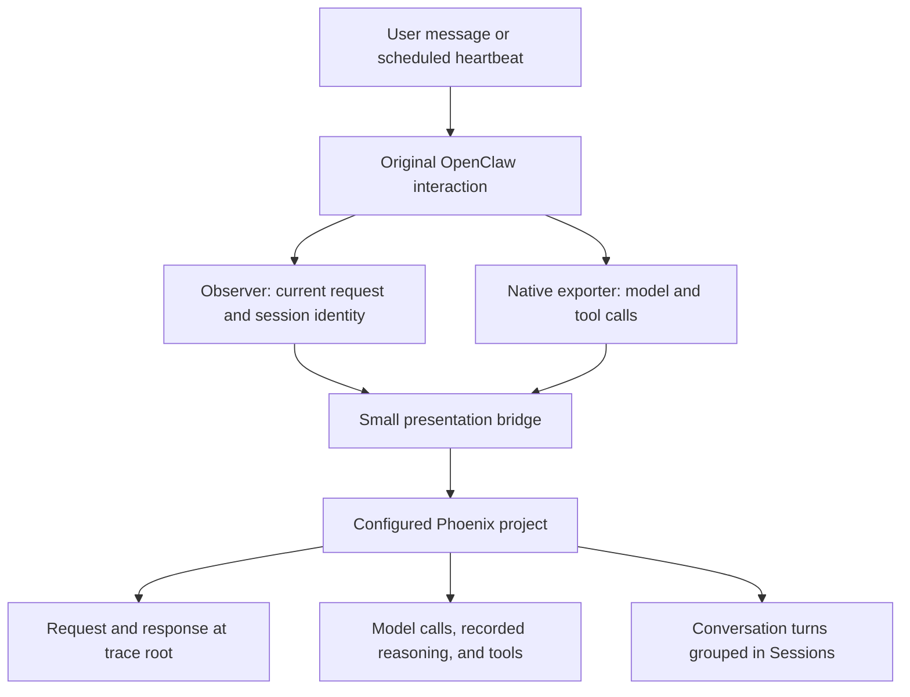

# Live conversation traces

The source lives in this repository's `observer/` directory. It runs on the Mac
mini alongside OpenClaw. A full OpenClaw source checkout is not needed for this
experiment. We keep the exact upstream exporter hash, a small patch builder,
tests, and a timestamped deployment backup instead.

## What the change does

One interaction keeps its original native trace ID. Its `openclaw.harness.run`
root becomes an AGENT span named **Conversation**, **Heartbeat**, **Scheduled task**
or **Evaluation**, with the current request and the last model response
visible in Phoenix's Input and Output panels. The model and tool calls retain
their original IDs, parents, timings and content. A **Recorded reasoning** child
appears under a model call when that provider response includes reasoning text.
It is a zero-duration observation marker and adds no tokens or runtime.

Ordinary turns from the same actual OpenClaw session window share an opaque
`session.id`. Phoenix Sessions can therefore show the turns together. Isolated
heartbeats have separate session windows and separate groups. Scheduled cron
work is also labeled separately. This changes the display, not the history that
the assistant reads.

## Exact differences from the default exporter

| Area | Change |
| --- | --- |
| Observer scope | Explicit `sessionScope: "all"` includes this assistant's conversations, heartbeats, cron work and tagged evaluations. Other agents remain excluded. |
| Root Input | Current attempt prompt from `llm_input`; conversation history is not substituted for the current request. Missing input is identified explicitly. |
| Root Output | Last provider response's visible text; missing output is identified explicitly. This is not proof of Telegram delivery. |
| Span kind and name | Root labeled AGENT and given a readable interaction name, with its original name saved in an attribute. Native model/tool span names stay intact for existing analysis filters. |
| Conversation grouping | Hash of the actual session window ID in `session.id`, with separate conversation, heartbeat, cron and evaluation prefixes. No raw routing identifiers added. |
| Recorded reasoning | Opt-in text from each native provider response before default exporter redaction, with credential masking and a 16,000-character limit. Native content policy must allow output capture. No private signatures are exported. |
| Tool-result labels | Preserve the source `toolName` as the normalized result message's `name`, joined by exact call ID. Phoenix shows `tool: memory_search`, for example. The inner `Tool Result: <ID>` row remains Phoenix's standard ID display. Tool IDs, result bodies and native span names are unchanged. |
| Token accounting | Individual model calls retain their usage. Aggregate usage remains as diagnostic counters but stops being counted a second time as an LLM call. |
| Local records | Existing evaluation JSONL files unchanged; other sessions saved under `phoenix-evals/live/`. |

The patch does not change prompts, tools, model configuration, memory, heartbeat
isolation, schedules, routing, or account actions. It does not delete or rewrite
old Phoenix traces or notes. The earlier `openclaw-conversations` examples remain
historical reconstructions. The original deployment sent live data to
`openclaw-assistant`. Since September 29 at 11:51 UTC, the production exporter
routes new everyday activity to `openclaw-live`, while isolated benchmark
gateways retain `openclaw-assistant`. Historical traces remain in place.

This subsequent routing change adds only the production
`diagnostics.otel.headers["x-project-name"]` header. Native hot reload and new
production RPC spans in `openclaw-live` were verified without a gateway restart
or model call. All frozen trial configurations and workspace instruction files
were unchanged. The next scheduled morning message was not forced for testing.
See the [routing audit](../runs/phoenix-live-routing-20260929T115004Z/change.json)
and [Phoenix readback](../runs/phoenix-live-routing-20260929T115004Z/routing-readback.json).

## Installation and maintenance

The supported installed version is OpenClaw **2026.9.5 (`ec9c1a1`)**, with
`@openclaw/diagnostics-otel` 2026.9.5. The upstream runtime file SHA-256 is
`f0366f582292f8744bab8ae4e428f2e92d00e542f9fd9753a573105fe4e5cf21`.

1. Back up the installed observer, native runtime file and configuration.
2. Run `npm test` in `observer/` locally and in a staging directory on the mini.
3. Build a patched copy with `observer/patch-native-exporter.py`, supplying the
   exact upstream source file, output path and installed observer directory.
4. At an idle boundary, install the observer files and patched native runtime.
   Set only `sessionScope: "all"` and `liveExport: true`; preserve other settings.
5. Restart the gateway, check plugin and gateway health, then verify two ordinary
   non-delivering turns share one Phoenix session but have separate trace IDs.
6. Read back the spans, inspect the question, response, tool and reasoning panels,
   and record the outcome in the deployment audit.

The native patch is local, not an upstream OpenClaw feature. An OpenClaw plugin
update may replace it. Do not apply it blindly to a new version: the hash guard
requires a source review and rebuilt patch. Keep the observer and native patch
installed together.

Rollback: at an idle boundary, restore the backed-up native runtime and observer
directory; restore only the observer's two changed config keys (or its prior
entry if nothing else changed); restart and verify health. Avoid restoring the
whole config file over unrelated changes made after deployment.

## Limits for the cookbook

An exported response is not a sent message, and completed execution is not a
correct answer. Delivery must be verified independently. Recorded reasoning is
model-produced text, not complete internal computation. Existing content limits
and redaction still apply. This improves new live traces only; historical traces
need the separately labeled reconstruction workflow. Compare experiment results
across this deployment using explicit timestamps because the reporting format
and token accounting changed.

Deployment audit: `runs/live-conversation-deploy-20260929T011341Z/change.json`.

## Verified deployment, September 28

Installed at 6:25 PM PDT after active work finished. All 20 observer tests passed
locally and on the mini. The native patch passed its syntax and version checks.
The gateway loaded both plugins without reporting degraded plugins. A comparison
of the assistant's behavior settings before and after installation matched.

Two ordinary, non-evaluation-tagged turns were then completed with delivery
disabled. Phoenix shows two separate native traces in
[one conversation session](https://app.phoenix.arize.com/s/matildaorona/projects/UHJvamVjdDoyMw==/sessions/UHJvamVjdFNlc3Npb246MzI=?sessionView=turns).
The first asked the assistant to check its model using `session_status`; the
second correctly recalled a word from the previous answer. Both current questions
and final answers were checked against the gateway response and in Phoenix's
Turns panel. The first trace's tool parameters, result and recorded reasoning
were also verified in the interface.

- [First interaction: question, tool, reasoning and answer](https://app.phoenix.arize.com/s/matildaorona/redirects/traces/0bf798a3bdb555e846b009e1f789d019)
- [Follow-up in the same session](https://app.phoenix.arize.com/s/matildaorona/redirects/traces/3e6242fe07d5022b00b35e728dd74f15)

These are instrumentation checks, not assistant-quality experiment results.
No aggregate usage span was emitted for these two requests; the change that
prevents duplicate token accounting is covered by tests, not this live sample.
The next naturally scheduled heartbeat is still due for live verification of
the **Heartbeat** name and its separate session; the existing monitor now checks
that. Earlier traces retain their existing names and before/after annotations.

At 6:36 PM PDT, observer 1.1.1 added tool-result names. All 22 tests passed
locally and on the mini, and installation happened with no active tasks or running
sessions. The gateway restart loaded both plugins; the entire configuration file
had the same hash before and after. This presentation change is recorded separately
in `runs/tool-label-deploy-20260929T013525Z/change.json`.

A fresh non-delivering check completed in 75.9 seconds. Phoenix's API retained
the tool names for both conversation-history results and the new tool result;
the interface visibly showed **tool: session_status** above the unchanged ID.
[Open the verified message card](https://app.phoenix.arize.com/s/matildaorona/projects/UHJvamVjdDoyMw==/traces/73f18b68b04a1046c5cb120c1cdbd0d2?selectedSpanNodeId=U3BhbjoxMzkyOQ%3D%3D).

The label uses Phoenix's existing support for
[`message.name`](https://arize-ai.github.io/openinference/spec/llm_spans.html#tool-role-messages).
Phoenix's [message renderer](https://github.com/Arize-ai/phoenix/blob/cd0512e39e9db4d9d419f2a753c4fecc1510ab81/js/app/src/pages/trace/span/LLMMessage.tsx)
shows that name in the outer card and the call ID in the inner result row. No
Phoenix frontend fork or alteration of historical traces is needed.
